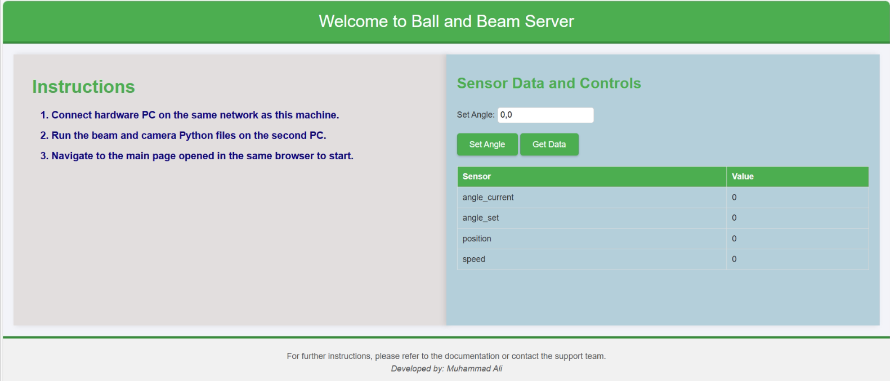

# Flask-For-Seesaw-Control-System

This repository is dedicated to managing the seesaw hardware system designed to balance a ball at a specified setpoint. It provides all the necessary files to set up a Flask server for seamless communication between the seesaw hardware and a control PC. The control PC runs Reinforcement Learning (RL) agents and PID controllers to achieve precise control over the system.

Key Features
1. Flask Server for Communication
Facilitates data exchange between the seesaw hardware and the control PC.
Sends control commands to the hardware and receives sensor data for monitoring and logging.
2. User-Friendly Web Interface
A clean and interactive webpage that enables:
Manual Control: Set beam angle values manually for testing or calibration.
Real-Time Monitoring: Display live data such as ball position, beam angle, and system status.
User Guidance: Clear instructions to ensure easy operation and setup.
3. Seamless Integration with RL and PID Controllers
Designed to work alongside the RL agents and PID controllers from the control PC.
Enables quick testing and deployment of control strategies developed in the companion repository.
System Overview
Flask Server: Acts as the communication hub, ensuring efficient and reliable data exchange.
Web Dashboard: Provides an intuitive interface to interact with the system, whether for monitoring or control purposes.
Hardware-Control PC Interaction: Bridges the hardware and computational components, enabling the deployment of sophisticated control strategies.
Related Repository
The RL agents and PID controllers used for controlling the ball position on the seesaw can be found in the companion repository:
👉 RL Agent to Control Ball Position on Seesaw: [RL-Agent to Control Ball Position on Seesaw](https://github.com/MuhammadAliacc/RL-Agent-To-Control-BallPosition-On-Seesaw)
 
This repository contains the training and deployment files for the RL agents, along with the implementation of PID controllers. Together, these repositories form a complete system for seesaw control.

Contribute
Feel free to explore this project to see how modern control strategies integrate with hardware systems. Contributions, suggestions, and feedback are highly welcome to enhance this project further!
